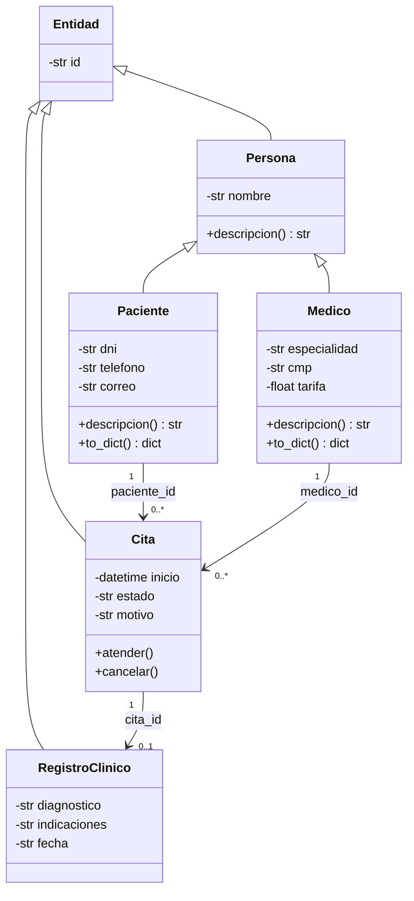
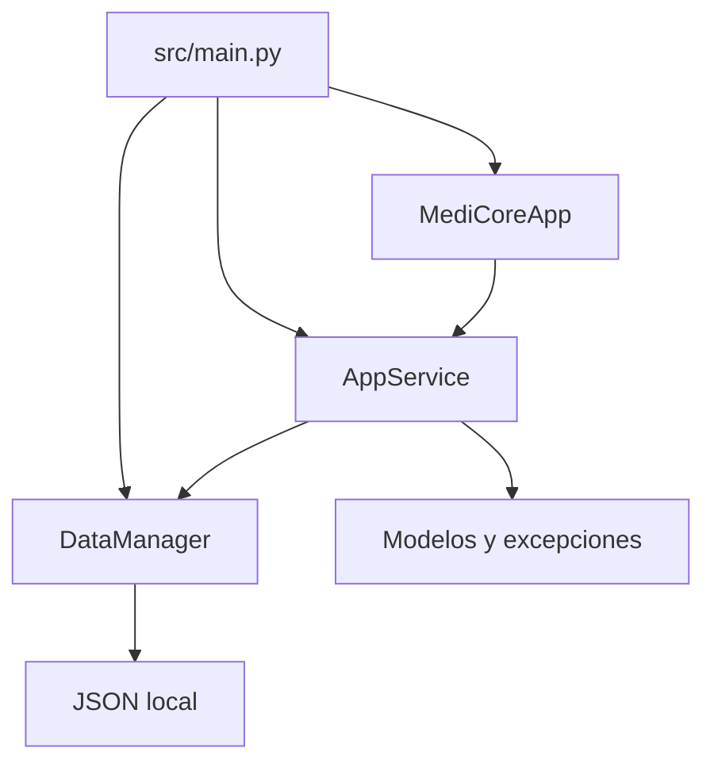
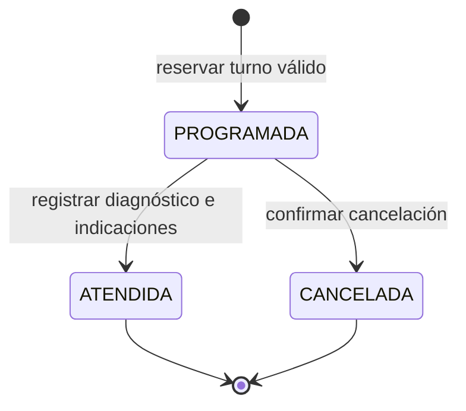

# Arquitectura de MediCore

## Capas e inversión de dependencias de ejecución

- **Dominio** (`src/domain/`): Persona, Paciente, Medico, Cita y RegistroClinico. No importa UI ni persistencia. Validaciones y errores de negocio propios.
- **Servicios y datos** (`src/services/`): AppService coordina casos de uso y recibe DataManager en su constructor. DataManager lee/escribe JSON.
- **Presentación** (`src/ui/`): MediCoreApp presenta una única interfaz interna para el encargado. Widgets reutilizables en `widgets.py`; recursos en `assets/`. Las acciones invocan servicios.
- **Composición** (`src/main.py`): resuelve la ruta de datos, construye dependencias y abre la GUI. `main.py` raíz delega al punto obligatorio.

Las asociaciones se almacenan por ID. Especialidad es un atributo validado de Medico y su catálogo se obtiene de los médicos; no hay una entidad Especialidad independiente. Las entidades exponen propiedades de lectura y serializan a diccionarios. `descripcion()` se redefine en Paciente y Medico como ejemplo de polimorfismo.

## Flujo de atención

AppService valida fecha y disponibilidad antes de crear citas. Atención valida hora de inicio y campos antes de cambiar estado y crear historia. Cancelación libera el horario. La tarifa queda copiada en la cita para conservar el precio de reserva. Cada cambio usa una instantánea de memoria; si guardar falla, se restaura. El JSON se escribe primero en un temporal en la misma carpeta y después se reemplaza atómicamente.

## Indicadores

PROGRAMADA, ATENDIDA y CANCELADA se cuentan por estado; el panel muestra totales del centro y las historias se consultan por paciente. El valor de las atenciones suma tarifas ATENDIDAS, sin inferir que se hayan pagado. No hay un módulo de caja ni pasarela de pago.

## Persistencia y límites

Esquema JSON versión 1: `pacientes`, `medicos`, `citas` y `registros`. Al cargar se reconstruyen objetos, validan referencias, DNI/CMP únicos y correspondencia entre atenciones e historias. Es un almacenamiento local para una instancia; no tiene bloqueo multiusuario, autenticación ni cifrado. El reloj se inyecta en AppService para probar reglas temporales sin depender del día real.

## Operación presencial B2C

El encargado es el único actor de la interfaz: registra pacientes, selecciona médico y paciente para una cita, mantiene la agenda y transcribe la atención del profesional. No existen rutas de autoservicio ni selector de roles. Paciente es una entidad del dominio, no un usuario autenticado. Navegación: Resumen, Agenda, Pacientes, Médicos e Historias clínicas.
